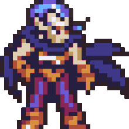
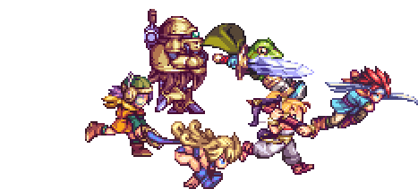

<h1 align="center"> Welcome, Warriors!</h1>

  

<h3 align="left">I'm Luciano Lanes, Back-End Developer and Time Traveler.</h3>

- :bear: About: **A 28y brazilian dev who loves to code and learn something new.**

- 👨‍💻 Some of my projects are available <a href="https://lucianolanes.github.io/" target="_blank">**here**</a>

- :robot: My email: **llaneslopes@gmail.com**

<h3 align="left">Let's Connect:</h3>

<h3 align="left">Languages and Tools:</h3>

           

   

